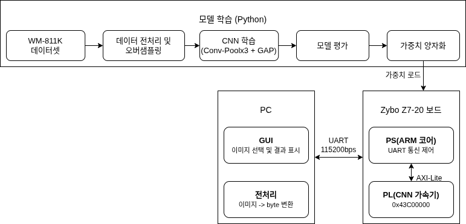

# NPU for Wafer Varification

> CNN 추론을 FPGA 하드웨어로 구현한 Wafer 결함 자동 분류 시스템

---

## 1. Overview

| 항목 | 내용 |
|------|------|
| 플랫폼 | Zybo Z7-20 (Zynq XC7Z020) |
| 언어 | Python, Verilog, C |
| 도구 | Vivado 2024.2, Vitis 2024.2 |
| 통신 | UART (115200 bps), AXI4-Lite |
| 개발 기간 | 2026.06.23 - 07.03 |
| 팀 구성 | 3인 팀 프로젝트 |

---
 
## 2. 주요 기능

- **WM-811K 웨이퍼 맵 CNN 결함 분류** — 9종 결함 유형을 분류하는 CNN 모델을 학습해 FPGA 하드웨어 IP로 구현
- **AXI4-Lite 기반 커스텀 CNN 추론 IP** — Conv/Pool/GAP/FC 전 레이어를 Verilog RTL로 설계한 하드웨어 가속기
- **PyQt5 통합 GUI** — 단일/배치 추론, CSV+PDF 리포트, 수율 추이 비교

## 3. 담당 역할
 
**CNN 모델 설계·학습과 추론용 하드웨어 IP 설계를 담당했습니다.**
 
- **CNN 모델 설계/학습** — Conv-Pool ×3 + GAP + Dense(9) 구조 설계 및 학습(정확도 89.1%), 레이어별 최적 양자화 적용
- **추론 IP 설계 (Verilog)** — conv/pool/GAP/FC 레이어 모듈과 이를 시퀀싱하는 FSM, AXI4-Lite 슬레이브 래퍼 설계

## 4. 시스템 아키텍처 및 핵심 구현

| 단계 | 내용 |
|---|---|
| ① 모델 개발 | WM-811K 데이터 전처리 → CNN 학습 → 레이어별 최적 양자화 후 .mem 변환 |
| ② 추론 IP 설계 | 양자화 가중치를 RTL ROM에 로드, 레이어별 모듈을 FSM으로 순차 구동하는 AXI4-Lite IP로 패키징 |
| ③ SoC 통합 | Zynq PS — AXI4-Lite — CNN 추론 IP(PL) 연결 (베이스 주소 0x43C00000) |
| ④ 보드-PC 연동 | GUI가 UART로 이미지 전송 → 펌웨어가 레지스터 기록/추론 시작 → 결과 회신 |
 
**결과**: 정확도 89.1% / 타이밍 여유 +3.66ns / BRAM 사용률 19.3% / 소비전력 1.57W
 
## 5. 트러블슈팅
 
| 발생 문제 | 발생 원인 | 해결 방안 | 결과 |
|---|---|---|---|
| 가중치 규모 과다 | Flatten+Dense 구조로 가중치 약 7만 개 발생 | GAP 구조로 전환, conv3 채널 확장(32→64)으로 보완 | 가중치 576개로 축소 |
| 클래스 쏠림 버그 | 활성화 값 표현 범위(Q1.7)가 실제 최대치보다 좁아 상당수 값이 saturate | 실측 기반으로 활성화 표현 범위 재조정 | 정확도 23.3%→63.9%로 개선 |
| 클럭 타이밍 여유 부족 | 단일 대형 모듈 구조로 신호 도달 시간 부족 | 클럭 40MHz 조정 + 레이어별 모듈 분리 | 타이밍 마진 확보, 모듈별 검증 가능 |

---

## 6. 디렉토리 구조

| 경로 | 역할 |
|------|------|
| `01_python/` | CNN 모델 학습·평가·가중치 양자화 (Python) |
| `02_vivado/ip_repo_cnn_npu/src/` | CNN 가속기 RTL 및 가중치 .mem (Verilog) |
| `03_vitis/wafer_npu_app/src/` | UART 통신 및 추론 실행 펌웨어 (C) |
| `04_python_ui/` | PC용 PyQt5 GUI |
